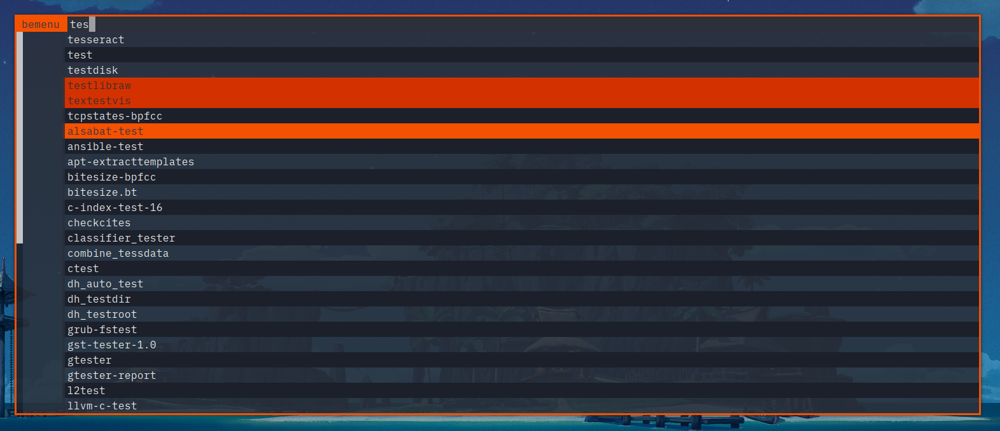

# bemenu-orange-wrapper

A bash wrapper script for [bemenu](https://github.com/Cloudef/bemenu) with a simple, dark and orange theme and nice defaults.



## Dependencies

- [bemenu >= 0.6](https://github.com/Cloudef/bemenu)
- [Nerd Fonts (Symbols Only)](https://github.com/ryanoasis/nerd-fonts/releases/latest)
- [Noto Color Emoji](https://github.com/googlefonts/noto-emoji)
- [IBM Plex Mono](https://github.com/IBM/plex)
- Bash >= 5

## Installation

```bash
git clone --depth 0 https://github.com/tkapias/bemenu-orange-wrapper.git bemenu-orange-wrapper
cd bemenu-orange-wrapper
chmod +x bemenu-orange-wrapper.sh
ln -s $PWD/bemenu-orange-wrapper.sh $HOME/.local/bin/bemenu
```

## Features

- Centered
- Vim keybindings.
- Border.
- Fonts ready for Emojis and Nerd-Fonts.
- Dark grey and orange theme.

## Usage

Just symlink the wrapper script as bemenu in your user bin path, it should be used by default by other bemenu tools.

To change some options, just edit the script.
